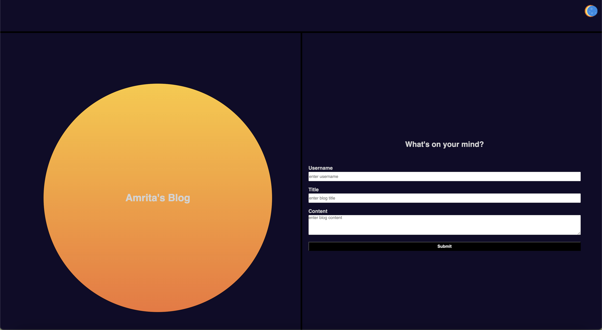

# Amrita's Blog

## Description

Welcome to my blog. This web app has been created using HTML, CSS and Javascript. The webapp allows users to submit blog entries, which are stored in localstorage in the browser and then listed in a new page. 

## Usage
1. Upon launching the webapp the user will be provided with a form asking for username, blog title and content.
2. If the user fails to enter either of the fields the page will display an error as show in the screen shot below. The error will dissaper once the user starts typing again.

3. Once the form is filled (see screenshot below), the user can submit the form.

4. Upon submitting the form, the entries will be stored in localstorage (see screenshot).

5. The user will then be directed to another page where all his blog entries will be displayed.
6. The page also has a 'Back' button to navigate back to the landing page.

7. Moreover, the website has a light/dark mode toggle button at the top right corner of the page which will toggle the background/font color of the page between light and dark mode. 

8. The author's info is presented in the footer in the blog entries page as shows below.

Installation
N/A

Usage
In order to view the portfolio page visit: https://amritank.github.io/an-blog/

License
Please refer to the LICENSE in the repo.
